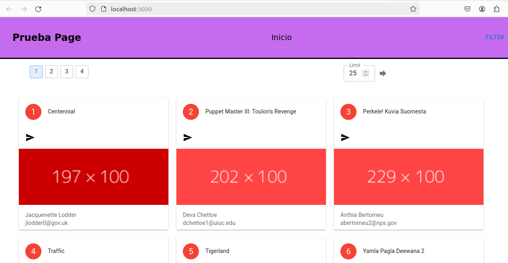
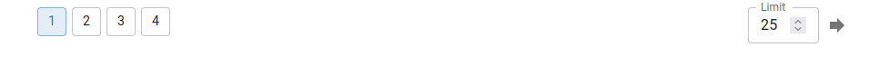
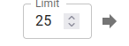
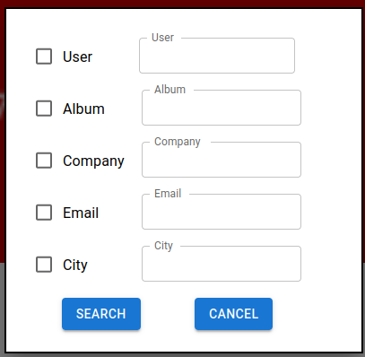
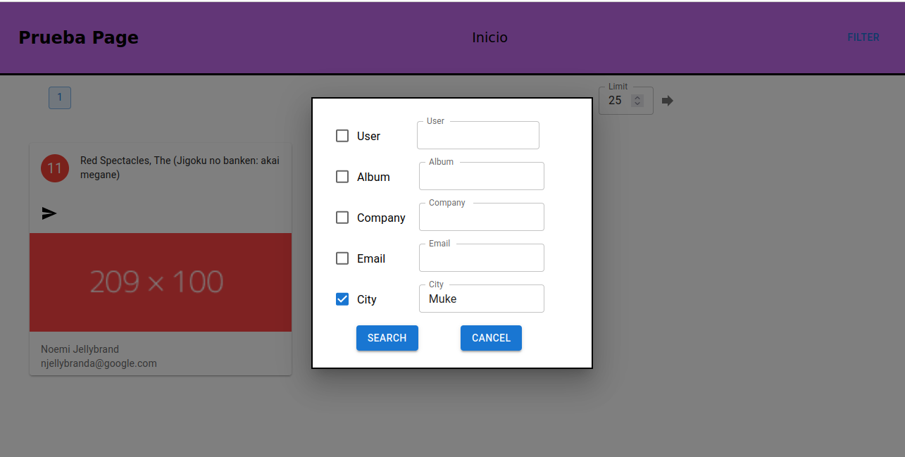

# Mega_Photo
Sitio que permite poder visualizar los datos de imagenes, alojadas en la base de datos, que se accedera por medio del api ApyTypeScript, que nos permitira navegar dentro de la informacion, nos permitira mostrar la informacion de forma sencilla en un tipo cuadricula en la cual se mostrara las images, cargadas desde la url asociada.

Nos muestra los elementos cargados de la base de datos, los datos de la imagenes con alguna informacion para identificar cada una de las mismas y el id de la foto.

Podremos cambiar el filtro de imagenes cargadas por paginacion entre los valores de 1 - 25, y volver a realizar la busqueda dando click en el boton.

### Filtros

Nos permitira generar busqueda por medio de filtro, indicaremos que valores deseamos utilizar y enviamos el texto a buscar por coincidencias

resultado

## Librerias y Modulos
* typescript
* NodeJS
* Mui (material y framework visual)

## Ejecucion
Se realizara por medio del comando 

**npm start**

Podemos cambiar la url del api a consumir dentro del archivo App.js la constante:
*  const URL :string   = "http://localhost:7000"

## Repositorio
El url del repositorio de datos es: https://github.com/capcomasd1080/megaphotosite

